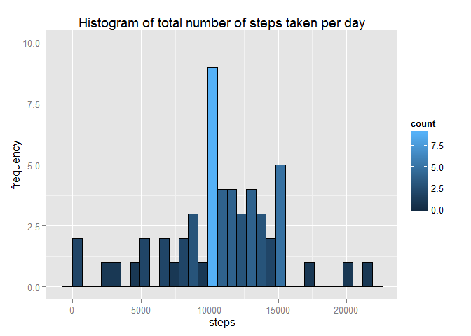
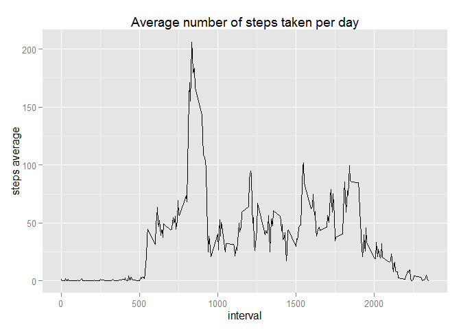
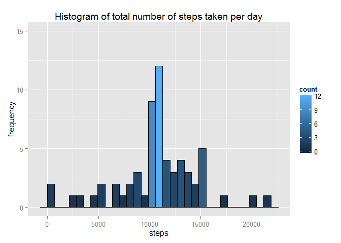
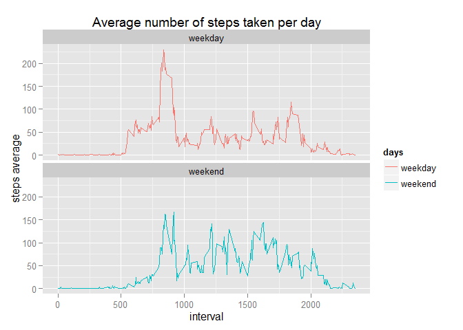

# Reproducible Research: Peer Assessment 1
Library used :

* dplyr for data manipulation
* ggplot for graphics

Sys.setlocale is used to set the dates in english


```r
library(dplyr);
library(ggplot2);
Sys.setlocale("LC_TIME", "C");
```

```
## [1] "C"
```
## Loading and preprocessing the data

1. Load the data (i.e. read.csv())

2. Process/transform the data (if necessary) into a format suitable for your analysis


###For data analysis, the steps for loading data are :

* create directory if necessary
* load file
* unzip it
* create dataset from file


```r
# Set working directory (create it if necessary)
wd<-"~/datascience/05_Reproducible Research/01";


if(!file.exists(wd)){
    dir.create(wd);
}

setwd(wd);

#download the data file from the web, and save it locally with date and time in name 
dateDownloaded<-format(Sys.time(), "%Y%M%d_%H%M%S");
fileUrl<-"https://d396qusza40orc.cloudfront.net/repdata%2Fdata%2Factivity.zip";
fileZip<- paste(dateDownloaded,"_dataActivity.zip");

download.file(fileUrl,fileZip,method="curl");
unzip(fileZip, overwrite=TRUE);

#create dataset
dataActivity<-read.csv2("activity.csv", sep=",");

#transform data (date)
dataActivity[,2]<-as.Date(dataActivity[,2],"%Y-%m-%d");
```

## What is mean total number of steps taken per day?

1. Calculate the total number of steps taken per day

2. If you do not understand the difference between a histogram and a barplot, research the difference between them. Make a histogram of the total number of steps taken each day


```r
#create a new dataset with dplyr. Group and sum the steps by date.
dataStepDay<-dataActivity %>% select(steps, date) %>% group_by(date) %>% summarise(stepSum = sum(steps));

#create histogram with ggplot2
ggplot(data=dataStepDay, aes(dataStepDay$stepSum)) + geom_histogram(col="black",aes(fill=..count..)) + labs(title="Histogram of total number of steps taken per day") + ylab("frequency") + xlab("steps") + ylim(c(0,10));
```

 
3. Calculate and report the mean and median of the total number of steps taken per day


```r
#Mean and median are calculated with dplyr
dataStepDay %>% na.omit() %>% summarise(Mean = mean(stepSum),Median = median(stepSum));
```

```
## Source: local data frame [1 x 2]
## 
##       Mean Median
## 1 10766.19  10765
```

## What is the average daily activity pattern?


```r
#create a new dataset (dataStepFiveMin) with dplyr. Group and average the steps by intervals.
dataStepFiveMin<-dataActivity %>% na.omit() %>% select(steps, interval) %>% group_by(interval) %>% summarise(stepMean = mean(steps));
```

1. Make a time series plot (i.e. type = "l") of the 5-minute interval (x-axis) and the average number of steps taken, averaged across all days (y-axis)

```r
#create time serie plot with ggplot2
ggplot(dataStepFiveMin, aes(x=interval, y=stepMean)) + geom_line() + labs(title="Average number of steps taken per day") + ylab("steps average");
```

 

2. Which 5-minute interval, on average across all the days in the dataset, contains the maximum number of steps?

```r
#Retrieve the interval that cotains the maximum number of steps with dplyr
dataStepFiveMin %>% select(everything()) %>% group_by(interval) %>% summarise(max(stepMean)) %>% top_n(n=1);
```

```
## Selecting by max(stepMean)
```

```
## Source: local data frame [1 x 2]
## 
##   interval max(stepMean)
## 1      835      206.1698
```


## Imputing missing values

Note that there are a number of days/intervals where there are missing values (coded as NA). The presence of missing days may introduce bias into some calculations or summaries of the data.

1. Calculate and report the total number of missing values in the dataset (i.e. the total number of rows with NAs)


```r
dataActivity %>% filter(is.na(steps)) %>% count(steps);
```

```
## Source: local data frame [1 x 2]
## 
##   steps    n
## 1    NA 2304
```

2. Devise a strategy for filling in all of the missing values in the dataset. The strategy does not need to be sophisticated. For example, you could use the mean/median for that day, or the mean for that 5-minute interval, etc.

3. Create a new dataset that is equal to the original dataset but with the missing data filled in.


```r
# points 2 and 3 are treated in one step with dplyr
#create a new dataset that contains values for all missings datas. The strategy is to use the dataset "dataStepFiveMin" created before. If a data is missing, replace it with the average value.  
filledDataActivity<-right_join(dataActivity, dataStepFiveMin, by = "interval") %>% mutate(stepFilled = ifelse(is.na(steps), stepMean, steps)) %>% select(steps = stepFilled, date, interval);
```

4. Make a histogram of the total number of steps taken each day and Calculate and report the mean and median total number of steps taken per day. Do these values differ from the estimates from the first part of the assignment? What is the impact of imputing missing data on the estimates of the total daily number of steps?


```r
#create a dataset with grouped values
filledDataStepDay<-filledDataActivity %>% select(steps, date) %>% group_by(date) %>% summarise(stepSum = sum(steps));

ggplot(data=filledDataStepDay, aes(filledDataStepDay$stepSum)) + geom_histogram(col="black",aes(fill=..count..)) + labs(title="Histogram of total number of steps taken per day") + ylab("frequency") + xlab("steps") + ylim(c(0,15));
```

 

```r
# calculate new mea and median
filledDataStepDay %>% na.omit() %>% summarise(Mean = mean(stepSum),Median = median(stepSum));
```

```
## Source: local data frame [1 x 2]
## 
##       Mean   Median
## 1 10766.19 10766.19
```

## Are there differences in activity patterns between weekdays and weekends?

For this part the weekdays() function may be of some help here. Use the dataset with the filled-in missing values for this part.

1. Create a new factor variable in the dataset with two levels - "weekday" and "weekend" indicating whether a given date is a weekday or weekend day.


```r
##Create a new factor variable in the dataset with two levels - "weekday" and "weekend" indicating whether a given date is a weekday or weekend day.
filledDataActivity<-filledDataActivity %>% mutate(days = ifelse((weekdays(filledDataActivity$date) == "Saturday" | weekdays(filledDataActivity$date) == "Sunday"), "weekend" , "weekday"));

filledDataStepFiveMin <-filledDataActivity %>% select(steps, interval, days) %>% group_by(interval, days) %>% summarise(stepMean = mean(steps));
```

2. Make a panel plot containing a time series plot (i.e. type = "l") of the 5-minute interval (x-axis) and the average number of steps taken, averaged across all weekday days or weekend days (y-axis). See the README file in the GitHub repository to see an example of what this plot should look like using simulated data.


```r
ggplot(filledDataStepFiveMin, aes(x=interval, y=stepMean)) + geom_line(aes(colour=days)) + facet_wrap( ~days, nrow = 2) + labs(title="Average number of steps taken per day") + ylab("steps average");
```

 
